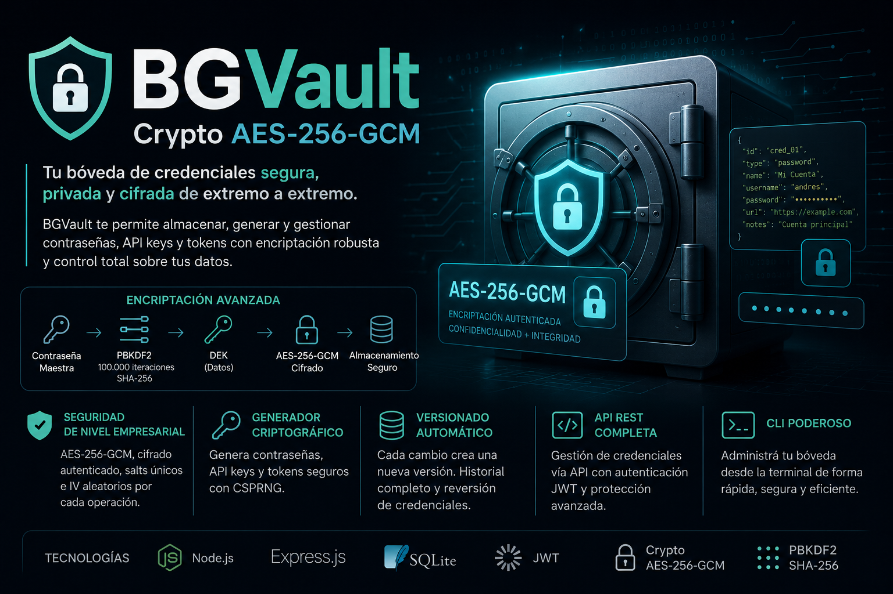

<div align="center">
  
</div>

<div align="right">
  
  &nbsp;
  
  &nbsp;
  
  &nbsp;
  
  &nbsp;
  
  &nbsp;
  
  &nbsp;
  
  &nbsp;
  
</div>

<br>

<div align="right">
  <a href="./doc/assets/translation/README.es.md" target="_blank">
    
  </a>
  &nbsp;
  <a href="./README.md" target="_blank">
    
  </a>
</div>

<div align="center">

# BGVault — Encrypted Credential Vault (AES-256-GCM) 

</div>

REST vault for **passwords, API keys, tokens and notes**. Every credential is encrypted with **AES-256-GCM** before it hits SQLite; list and GET by id return **metadata only**. Plaintext never travels in a query string: it comes out only through authenticated `POST /reveal`. Built with **Node.js** and **Express**, using **`node:crypto` only** (no `bcrypt`, `crypto-js` or external KMS).

* [**API (production):**](https://bgvault.onrender.com)
* [**API (local):**](http://localhost:3000/)
<!-- Functional tests video: add YouTube link here when recorded. -->

<br>

## Index 📜

<details>
  <summary> View details </summary>

<br>

<div align="right">

`Last update: 17/08/26`

</div>

### Section 1) Description, configuration and technologies

* [1.0) Description.](#10-description-)
* [1.1) Project execution.](#11-project-execution-)
* [1.2) Project structure.](#12-project-structure-)
* [1.3) Technologies.](#13-technologies-)

### Section 2) Usage flow and behavior

* [2.0) App flow.](#20-app-flow-)
* [2.1) Authentication.](#21-authentication-)
* [2.2) Response contract.](#22-response-contract-)
* [2.3) API endpoints.](#23-api-endpoints-)
* [2.4) Security, encryption and limits.](#24-security-encryption-and-limits-)

### Section 3) Testing, hosted demo and references

* [3.0) Functional test.](#30-functional-test-)
* [3.1) Hosted sandbox (Render).](#31-hosted-sandbox-render-)
* [3.2) Contributing.](#32-contributing-)
* [3.3) License.](#33-license-)

</details>

<br>

## Section 1) Description, configuration and technologies

### 1.0) Description [🔝](#index-)

<details>
  <summary>View details</summary>

<br>

This is a **credential vault API**, not a standalone encrypt/decrypt toy. You register, get a JWT, then create / list / patch / reveal / verify / rotate / delete secrets. Listings never include ciphertext or plaintext.

Why it exists:

* Storing secrets in a REST body that later leaks to logs or `GET ?decrypt=true` is the usual trap. Reveal is **POST** on purpose.
* Envelope encryption means a leaked row is not enough: each version has its own DEK; `ENCRYPTION_KEY` only wraps that DEK.
* Recruiter / reviewer sandbox: the **same API** is public at [https://bgvault.onrender.com](https://bgvault.onrender.com) (Render Free). Local SQLite keeps history across restarts; the hosted instance does not (see 3.1).

What the product delivers:

* **Four types:** `password`, `api_key`, `token`, `note` — each with a validated payload.
* **AES-256-GCM** authenticated encryption; GCM tag detects tampering.
* **AAD bound to the credential:** `credential:<id>:<type>:<version>` — a blob cannot be relocated to another id, type or version.
* **Envelope encryption:** 32-byte random DEK per version; `ENCRYPTION_KEY` wraps it with PBKDF2. Revealing a version does not run the master key over the payload bytes.
* **CSPRNG generator:** `POST /api/generate` builds passwords, API keys and tokens with `crypto.randomInt`.
* **PBKDF2** 100,000 iterations, SHA-256, when **wrapping** the DEK (not on every payload byte).
* **12-byte IV (NIST)** on payload and DEK wrap.
* **SQLite persistence** (`node:sqlite`, no ORM): credentials and versions survive a local restart.
* **TTL and one-time reveal:** `expiresAt` and `maxReveals` per version; expired or exhausted reveal/verify returns **410** without decrypting.
* **Versioning and rotation:** a payload change creates a new version; the previous one stays revealable.
* **Audit log:** generate, create, get, patch, reveal, verify, rotate, delete, versions, register, login and logout land in `audit_events` (no plaintext).
* **UUID ids** (numeric `index` was dropped).
* **Cleartext metadata, encrypted payload:** `name`, `service` and `tags` can be filtered and **PATCH**ed; GET never shows the secret.
* **Paginated lists:** `GET /api/credentials` and `GET /api/audit` use `limit` (max 200) and `offset`.
* **KEK rotation:** `ENCRYPTION_KEY_NEXT` + `npm run rewrap-keys` rewraps `wrapped_dek` without touching the payload.
* **JWT auth:** register/login issue a Bearer HS256 with `jti`; `POST /api/auth/logout` revokes it until `exp`.
* **Per-user isolation:** every credential and audit event has a `user_id`; a foreign JWT gets **404**, not 403.
* **Uniform JSON envelope:** successes include `requestId` + `timestamp`; errors are `{ error: { code, message }, requestId, timestamp }`.
* **Rate limit:** caps on register/login, reveal/verify, and optional global per IP via `RATE_LIMIT_IP_MAX` (`X-RateLimit-*`, **429** `RATE_LIMITED`).
* **No default key:** the process will not start with `default-key-change-me…`; it requires `ENCRYPTION_KEY` and `JWT_SECRET` (≥ 32 characters).
* **Postman collection:** success (201/200) and error (400/401/404/409/410) cases with `pm.test`; `environment` = `local` or `production`.
* **Reusable module:** copy `src/crypto/lib.js` into another Node project with no extra npm deps.
* **Env setup:** `npm run setup-env` creates or completes `.env`.

Accounts live in the `users` table. Legacy versions without `wrapped_dek` still decrypt with direct encryption.

To rotate `ENCRYPTION_KEY` without re-encrypting payloads: set `ENCRYPTION_KEY_NEXT`, run `npm run rewrap-keys`, copy the new key over `ENCRYPTION_KEY` and drop `NEXT`. While `NEXT` is set, `seal` uses that key and `open` accepts both.

**Requirements:**

* [Node.js](https://nodejs.org/) **22.13+** (`node:sqlite`; 22 or 24/26 recommended).
* npm.
* Postman (collection) or Bash / Git Bash (`client.sh`).
* `npm test` does **not** need a separate server: it boots the app on an ephemeral port with SQLite `:memory:`.

</details>

### 1.1) Project execution [🔝](#index-)

<details>
  <summary>View details</summary>

<br>

* Clone and enter the repo:

```bash
git clone https://github.com/andresWeitzel/Crypto-AES-256-GCM.git
cd Crypto-AES-256-GCM
```

* Install, write `.env`, start (never commit `.env`):

```bash
npm install
npm run setup-env
npm run server
```

The vault listens on `http://localhost:3000` (or `PORT`). Console:

```
BGVault corriendo en http://localhost:3000
Auth: JWT Bearer (POST /api/auth/register, /login; POST /api/auth/logout)
```

`setup-env` writes `.env` at the project root with:

| Variable | Role |
|----------|------|
| `PORT` | HTTP port (default `3000`) |
| `ENCRYPTION_KEY` | Master encryption key (≥ 32 characters, random) |
| `ENCRYPTION_KEY_NEXT` | Optional new KEK; when set, `seal` uses NEXT and `open` accepts both |
| `JWT_SECRET` | HMAC-SHA256 signing secret (must differ from `ENCRYPTION_KEY`) |
| `JWT_EXPIRES_IN` | JWT lifetime in seconds (default `28800` = 8 h; min 60, max 7 days) |
| `SQLITE_PATH` | SQLite file (default `data/bgvault.sqlite`) |
| `RATE_LIMIT_AUTH_MAX` | Register/login cap per IP (default `60`) |
| `RATE_LIMIT_AUTH_WINDOW_MS` | Auth window in ms (default `600000` = 10 min) |
| `RATE_LIMIT_REVEAL_MAX` | Reveal/verify cap per user (default `120`) |
| `RATE_LIMIT_REVEAL_WINDOW_MS` | Reveal/verify window in ms (default `60000` = 1 min) |
| `RATE_LIMIT_IP_MAX` | **Global** `/api/*` cap per IP; empty = off. Local: `.env`. Production: `render.yaml` |
| `RATE_LIMIT_IP_WINDOW_MS` | Global cap window (default `600000` = 10 min) |

Postman demo user: `demo@bgvault.local` / `bgvault-dev-password` (created by the Runner). Use different, long values anywhere that is not a throwaway sandbox.

**Do not** commit `.env` (it is in `.gitignore`). Local config lives in `.env` / `.env.example`. Hosted config for Render is `render.yaml` (Blueprint).

#### How to create `.env`

**Option 1 — setup (recommended)**

```bash
npm run setup-env
```

If keys are missing it generates `ENCRYPTION_KEY` and `JWT_SECRET` (32 bytes hex each). Existing keys are kept.

**Option 2 — copy the example**

```bash
cp .env.example .env
```

Fill `ENCRYPTION_KEY` and `JWT_SECRET` (at least 32 characters each).

**Option 3 — process environment**

```bash
export ENCRYPTION_KEY="your-secure-key-at-least-32-characters"
export JWT_SECRET="another-distinct-secret-32-chars-min"
export PORT=3000
```

The server loads `.env` at boot but **does not overwrite** variables already set on the process.

There is no hardcoded key. If `ENCRYPTION_KEY` or `JWT_SECRET` is missing, shorter than 32 characters, or `ENCRYPTION_KEY` is the old insecure demo value, the process **exits** and asks for `npm run setup-env`. `JWT_SECRET` is **not** derived from `ENCRYPTION_KEY`.

#### Useful scripts

| Script | Description |
|--------|-------------|
| `npm run setup-env` | Create or complete `.env` (`ENCRYPTION_KEY`, `JWT_SECRET`) |
| `npm run server` | Start the Express vault locally (`npm start` is the same entry) |
| `npm run client:post` | Register/login `demo@bgvault.local` and create a `password` credential |
| `npm run client:get` | List credentials for the demo user (metadata only) |
| `npm run decrypt-env` | Print `*_ENCRYPTED` values from `.env`, if any |
| `npm run rewrap-keys` | Rewrap `wrapped_dek` with `ENCRYPTION_KEY_NEXT` (payload untouched) |
| `npm test` | Native tests (`node --test`): auth, logout/`jti`, isolation, PATCH, paging, 410 |

`client:*` hits `http://localhost:3000`. Against production use Postman (`environment=production`) or curl with `BASE=https://bgvault.onrender.com`.

</details>

### 1.2) Project structure [🔝](#index-)

<details>
  <summary>View details</summary>

```
bgvault/
├── src/
│   ├── config/
│   │   └── env.js                   # Load .env; validate ENCRYPTION_KEY / JWT_SECRET / NEXT
│   ├── auth/
│   │   ├── password.js              # scrypt (hash / verify)
│   │   └── jwt.js                   # JWT HS256 + jti
│   ├── middleware/
│   │   ├── requireAuth.js           # Bearer JWT, jti not revoked
│   │   ├── requestId.js             # X-Request-Id (UUID or caller correlation)
│   │   └── rateLimit.js             # in-memory cap (auth + reveal + optional IP)
│   ├── http/
│   │   ├── respond.js               # envelope { error: { code, message } }
│   │   └── paging.js                # limit/offset (list and audit)
│   ├── db/
│   │   └── sqlite.js                # node:sqlite, schema, WAL, migrate
│   ├── store/
│   │   ├── usersStore.js            # Accounts
│   │   ├── credentialsStore.js      # Credentials + versions (scoped)
│   │   ├── auditStore.js            # Audit log (scoped)
│   │   └── revokedTokensStore.js    # revoked jti until exp
│   ├── controllers/
│   │   ├── authController.js        # register, login, me, logout
│   │   ├── generateController.js    # POST /api/generate
│   │   ├── credentialController.js  # CRUD, patch, reveal, verify, rotate, versions
│   │   └── auditController.js
│   ├── crypto/
│   │   ├── lib.js                   # encrypt / decrypt AES-256-GCM + AAD (DEK wrap)
│   │   ├── envelope.js              # seal / open / rewrap DEK per version
│   │   ├── generate.js              # CSPRNG passwords / api_key / token
│   │   └── crypto-cli.js            # CLI: encrypt / decrypt a value
│   ├── routes/
│   │   ├── authRoutes.js            # /api/auth
│   │   ├── generateRoutes.js        # /api/generate
│   │   ├── credentialRoutes.js      # /api/credentials
│   │   └── auditRoutes.js           # /api/audit
│   ├── app.js                       # Express, headers, 404 / invalid JSON
│   ├── server.js                    # load env, sqlite, listen
│   └── setup/
│       ├── setup-env.js             # Create or complete .env
│       ├── rewrap-keys.js           # Rewrap DEKs with ENCRYPTION_KEY_NEXT
│       └── decrypt-env.js           # Print *_ENCRYPTED
├── data/
│   └── .gitkeep                     # bgvault.sqlite (gitignored)
├── collections/
│   └── bgvault.postman_collection.json
├── test/
│   └── api.test.js                  # node --test (auth, jti, vault)
├── scripts/
│   └── client/
│       └── client.sh                # Bash client (post / get)
├── doc/
│   └── assets/                      # README banner, icons, flags, Spanish translation
│       ├── bgvault-background.png   # Header image
│       ├── icons/
│       └── translation/
│           └── README.es.md
├── .env.example
├── .nvmrc
├── render.yaml                      # Render Blueprint (production env)
├── package.json
└── README.md
```

</details>

### 1.3) Technologies [🔝](#index-)

<details>
  <summary>View details</summary>

<br>

| **Technology** | **Version** | **Purpose** |
| -------------- | ----------- | ----------- |
| [Node.js](https://nodejs.org/) | **≥ 22.13** | **Runtime** (`node:crypto`, `node:sqlite`) |
| [Express](https://expressjs.com/) | **4.x** | **HTTP API** |
| `node:crypto` | **built-in** | **AES-256-GCM, scrypt, HMAC-SHA256, UUID** |
| `node:sqlite` | **built-in** | **Persistence, versions, audit** |
| AES-256-GCM | **NIST** | **Authenticated encryption** |
| [Postman](https://www.postman.com/) Collection v2.1 | **collection** | **API contract tests** |
| [Render](https://render.com/) | **Free** | **Public sandbox** (`render.yaml`) |

**Native modules:** `node:crypto`, `node:sqlite`, `node:fs` / `node:path`, `node:readline` (reserved for interactive setup).

**Official docs:**

* Express: https://expressjs.com/
* Node.js crypto: https://nodejs.org/api/crypto.html
* SQLite (Node): https://nodejs.org/api/sqlite.html
* Render Blueprint spec: https://render.com/docs/blueprint-spec

This project does **not** use third-party crypto libraries (`bcrypt`, `crypto-js`, etc.). All encryption goes through `node:crypto`.

</details>

<br>

## Section 2) Usage flow and behavior

### 2.0) App flow [🔝](#index-)

<details>
  <summary>View details</summary>

<br>

The API is the same locally and in production. Change only the host.

| Environment | Base URL | For |
|-------------|----------|-----|
| **Local** | `http://localhost:3000` | development, `npm test`, full Postman Runner |
| **Production** | [`https://bgvault.onrender.com`](https://bgvault.onrender.com) | public demo (Render Free) |

1. Process boots → loads `.env` (local) or injected env (`render.yaml` on Render) → validates keys → opens SQLite → listens (`HOST` defaults to `0.0.0.0` in production).
2. `GET /` is the public index (auth and vault routes). `GET /health` is liveness.
3. Client registers or logs in → receives Bearer JWT with `jti`.
4. Client creates credentials (envelope seal), lists metadata, optionally PATCHes name/service/tags.
5. Reveal / verify are POST; expiry and `maxReveals` return **410** without decrypting.
6. Rotate creates a new version; previous versions stay in history.
7. Logout stores `jti` in `revoked_tokens` until `exp`.
8. Audit lists the **authenticated user’s** events only.

In Postman the collection variable `environment` is `local` or `production`; a pre-request script sets `{{baseUrl}}` to those same URLs.

</details>

### 2.1) Authentication [🔝](#index-)

<details>
  <summary>View details</summary>

<br>

`GET /` and `GET /health` are public. `POST /api/auth/register` and `POST /api/auth/login` are also public (they issue the token).

All `/api/credentials*`, `/api/audit*`, `POST /api/generate`, `GET /api/auth/me` and `POST /api/auth/logout` require:

```
Authorization: Bearer <accessToken>
```

Missing header, invalid or expired token, no `jti`, or deleted user: **401** `UNAUTHORIZED`. After logout the same token returns **401** `TOKEN_REVOKED`.

The JWT is **HS256** signed with `JWT_SECRET` (`node:crypto.createHmac`) and carries `jti`. The account password is stored with **scrypt** (`N=16384, r=8, p=1`); it never comes back in JSON. A failed login returns **401** `INVALID_CREDENTIALS` (it does not disclose whether the email exists).

A user **cannot see** another user’s credentials: list, get, patch, reveal, rotate and audit filter by `user_id`. If the id exists but belongs to someone else, the API returns **404** (not 403), so existence is not leaked.

</details>

### 2.2) Response contract [🔝](#index-)

<details>
  <summary>View details</summary>

<br>

Every JSON response includes `timestamp` and `requestId` (also in the `X-Request-Id` header). If you send `X-Request-Id` (8–128 characters `A-Za-z0-9._:-`), it is reused; otherwise a UUID is generated.

**Success** — the resource sits in `credential` / `credentials` / `user`. Reveal adds `payload` next to `credential` (GET never includes `payload`). `message` strings from the live API are in Spanish; branch on `error.code`, not on `message` text.

**Error:**

```json
{
  "error": {
    "code": "CREDENTIAL_EXPIRED",
    "message": "Credencial vencida"
  },
  "requestId": "3fa85f64-5717-4562-b3fc-2c963f66afa6",
  "timestamp": "2026-08-16T01:35:56.264Z"
}
```

| `code` | Status | When |
|--------|--------|------|
| `VALIDATION` | 400 | Invalid body or query |
| `JSON_INVALID` | 400 | Malformed JSON |
| `UNAUTHORIZED` | 401 | Missing/invalid JWT, no `jti`, or deleted user |
| `TOKEN_REVOKED` | 401 | Logout: `jti` is in `revoked_tokens` |
| `INVALID_CREDENTIALS` | 401 | Login with wrong email/password |
| `CREDENTIAL_NOT_FOUND` | 404 | Missing credential or another user’s |
| `VERSION_NOT_FOUND` | 404 | Version number does not exist |
| `ROUTE_NOT_FOUND` | 404 | Unknown HTTP path |
| `EMAIL_TAKEN` | 409 | Register with an email already used |
| `CREDENTIAL_EXPIRED` | 410 | `expiresAt` passed (no decrypt) |
| `REVEAL_LIMIT` | 410 | `maxReveals` exhausted (no decrypt) |
| `RATE_LIMITED` | 429 | Register/login, reveal/verify, or `RATE_LIMIT_IP_MAX` per IP |
| `INTERNAL` | 500 | Unhandled failure (generic message) |

5xx responses log `requestId` on the console for correlation.

Register/login: 60 req / 10 min per IP (`RATE_LIMIT_AUTH_MAX`). Reveal and verify: 120 / min per user. Optional global cap: `RATE_LIMIT_IP_MAX` requests to `/api/*` per IP and window (`RATE_LIMIT_IP_WINDOW_MS`). Headers `X-RateLimit-Limit`, `X-RateLimit-Remaining`, `X-RateLimit-Reset`; **429** also sends `Retry-After`.

**HTTP status summary**

| Code | Meaning |
|------|---------|
| 200 | Root, health, login, me, logout, generate, list, get, patch, versions, reveal, verify, rotate, delete, audit |
| 201 | User or credential created |
| 400 | Validation (email, account password, type, name, payload, expiresAt, maxReveals, verify on non-password) |
| 401 | Missing/invalid/expired JWT, or bad login |
| 404 | Foreign/missing credential or unknown route |
| 409 | Email already registered |
| 410 | Version expired or no reveals left |
| 429 | Rate limit on register/login, reveal/verify, or per-IP `RATE_LIMIT_IP_MAX` |

</details>

### 2.3) API endpoints [🔝](#index-)

<details>
  <summary>View details</summary>

<br>

```
http://localhost:3000
https://bgvault.onrender.com
```

Same paths. In Postman: `environment=local` or `environment=production`.

---

#### 1. Health check

Process liveness. No auth.

**GET** `/` — API index (browser).  
**GET** `/health` — liveness (local and Render).

**GET /** **200:** name, `health`, auth/vault routes and repo link. No `payload`.

**GET** `/health`

**200:**
```json
{
  "status": "OK",
  "persistence": "sqlite",
  "auth": "jwt",
  "crypto": "envelope",
  "requestId": "3fa85f64-5717-4562-b3fc-2c963f66afa6",
  "timestamp": "2026-08-16T01:35:56.264Z"
}
```

---

#### 2. Register

Creates the account, hashes the password with scrypt, returns a JWT. Email is normalized to lowercase.

**POST** `/api/auth/register`  
**Auth:** no  
**Status:** `201`

**Body:**
```json
{
  "email": "demo@bgvault.local",
  "password": "bgvault-dev-password"
}
```

| Field | Required | Rule |
|-------|----------|------|
| `email` | yes | Basic format, max 254 characters |
| `password` | yes | Between 8 and 128 characters |

**201:**
```json
{
  "message": "Usuario registrado",
  "user": {
    "id": "7c9e6679-7425-40de-944b-e07fc1f90ae7",
    "email": "demo@bgvault.local",
    "createdAt": "2026-08-16T01:35:56.264Z"
  },
  "accessToken": "eyJhbGciOiJIUzI1NiIsInR5cCI6IkpXVCJ9...",
  "tokenType": "Bearer",
  "expiresIn": 28800,
  "timestamp": "2026-08-16T01:35:56.264Z"
}
```

The response **never** includes `password` or `passwordHash`.

**Errors:**

| Status | When |
|--------|------|
| 400 | `VALIDATION` — missing email/password, invalid email, short password |
| 409 | `EMAIL_TAKEN` — email already registered |
| 429 | `RATE_LIMITED` — register/login cap per IP |

---

#### 3. Login

**POST** `/api/auth/login`  
**Auth:** no  
**Status:** `200`

Same body as register. Identical response except `message`: `"Sesión iniciada"`.

**Errors:** `400` `VALIDATION` if fields are missing; `401` `INVALID_CREDENTIALS` if the email does not exist or the password does not match; `429` `RATE_LIMITED` if the per-IP cap is exceeded.

---

#### 4. Profile (me)

**GET** `/api/auth/me`  
**Auth:** Bearer JWT

**200:**
```json
{
  "user": {
    "id": "7c9e6679-7425-40de-944b-e07fc1f90ae7",
    "email": "demo@bgvault.local",
    "createdAt": "2026-08-16T01:35:56.264Z"
  },
  "timestamp": "2026-08-16T01:35:56.264Z"
}
```

---

#### 5. Logout

Invalidates the current JWT. Each token carries a `jti` (UUID); on logout it is stored in `revoked_tokens` until it expires. A new login issues **another** `jti`.

**POST** `/api/auth/logout`  
**Auth:** Bearer JWT  
Body: not required.

**200:**
```json
{
  "message": "Sesión cerrada",
  "timestamp": "2026-08-16T01:35:56.264Z"
}
```

Later uses of the same token: **401** `TOKEN_REVOKED`. A token without `jti` (legacy) or with a bad signature is still **401** `UNAUTHORIZED`.

---

#### 6. Generate a secret

Builds a random value with `crypto.randomInt` (CSPRNG). **Does not persist it:** copy it into the `payload` of create/rotate if you want it stored.

**POST** `/api/generate`  
**Auth:** Bearer JWT

**Body:**
```json
{
  "kind": "password",
  "length": 24,
  "uppercase": true,
  "lowercase": true,
  "digits": true,
  "symbols": true,
  "excludeAmbiguous": true
}
```

Minimum body per kind (the rest uses defaults: password 20 with symbols; `api_key` 32 and `token` 48 **without** symbols):

```json
{ "kind": "api_key" }
```

```json
{ "kind": "token" }
```

| Field | Default | Notes |
|-------|---------|-------|
| `kind` | `password` | `password` \| `api_key` \| `token` (`note` N/A) |
| `length` | 20 / 32 / 48 by kind | integer 12–128 |
| `uppercase` `lowercase` `digits` | `true` | — |
| `symbols` | `true` on password, `false` on api_key/token | `!@#$%^&*_-+=?` |
| `excludeAmbiguous` | `true` | omits `I`, `O`, `l`, `0`, `1` |

**200:**
```json
{
  "kind": "password",
  "length": 24,
  "value": "wK7#mP9qR2xHvNt8s@BdYf3a",
  "options": {
    "uppercase": true,
    "lowercase": true,
    "digits": true,
    "symbols": true,
    "excludeAmbiguous": true
  },
  "requestId": "3fa85f64-5717-4562-b3fc-2c963f66afa6",
  "timestamp": "2026-08-16T01:35:56.264Z"
}
```

Guarantees at least one character from each active set. **400** if `kind` is invalid, `length` is out of range, or every set is `false`.

---

#### 7. Create credential

Encrypts `payload` with **envelope encryption**: random DEK AES-256-GCM (AAD = `credential:<id>:<type>:<version>`) and wrap of that DEK with `ENCRYPTION_KEY` (AAD = `dek:<id>:<version>`). Stores the record as **version 1**.

**POST** `/api/credentials`  
**Auth:** required  
**Status:** `201`

**Body (password):**
```json
{
  "type": "password",
  "name": "Gmail personal",
  "service": "Gmail",
  "tags": ["email"],
  "payload": {
    "password": "miContraseña123",
    "username": "usuario@example.com"
  }
}
```

TTL / single use (optional, at **version** level, not inside `payload`):

```json
{
  "type": "password",
  "name": "OTP",
  "maxReveals": 1,
  "expiresAt": "2027-12-31T00:00:00.000Z",
  "payload": {
    "password": "once",
    "username": "usuario@example.com"
  }
}
```

**Parameters:**

| Field | Required | Description |
|-------|----------|-------------|
| `type` | yes | `password` \| `api_key` \| `token` \| `note` |
| `name` | yes | Display name (cleartext metadata) |
| `service` | no | Associated product/service |
| `tags` | no | Array of strings |
| `payload` | yes | Sensitive object (encrypted whole) |
| `expiresAt` | no | Future ISO-8601; that **version** stops revealing when it expires |
| `maxReveals` | no | Integer 1–10000; each reveal/verify consumes one use |

Omitted: no expiry, unlimited reveals. `null` on rotate clears the inherited value.

**`payload` by `type`:**

| type | Required field | Optional fields |
|------|----------------|-----------------|
| `password` | `payload.password` | `payload.username` (and free extras) |
| `api_key` | `payload.key` | free extras |
| `token` | `payload.token` | free extras (`payload.expiresAt`, etc.); **not** the **version** `expiresAt` |
| `note` | `payload.text` | free extras |

Extra keys are encrypted with the blob. Only the required fields in the table fail validation.

**201:**
```json
{
  "message": "Credencial almacenada",
  "credential": {
    "id": "3fa85f64-5717-4562-b3fc-2c963f66afa6",
    "type": "password",
    "name": "Gmail personal",
    "service": "Gmail",
    "tags": ["email"],
    "currentVersion": 1,
    "version": 1,
    "expiresAt": null,
    "maxReveals": null,
    "revealCount": 0,
    "revealsRemaining": null,
    "expired": false,
    "createdAt": "2026-08-16T01:35:56.264Z",
    "updatedAt": "2026-08-16T01:35:56.264Z"
  },
  "timestamp": "2026-08-16T01:35:56.264Z"
}
```

The response **never** includes `payload` or ciphertext.

**Errors:**

| Status | When |
|--------|------|
| 400 | Invalid `type`, missing `name`, incomplete `payload`, bad `tags`, past `expiresAt`, invalid `maxReveals` |
| 401 | No JWT, invalid or expired token |

```json
{
  "error": { "code": "VALIDATION", "message": "name es requerido" },
  "requestId": "3fa85f64-5717-4562-b3fc-2c963f66afa6",
  "timestamp": "2026-08-16T01:35:56.264Z"
}
```

Other create examples:

```json
{
  "type": "api_key",
  "name": "Stripe live",
  "service": "Stripe",
  "payload": { "key": "sk_live_demo_not_a_real_key" }
}
```

```json
{
  "type": "token",
  "name": "GitHub PAT",
  "service": "GitHub",
  "payload": {
    "token": "ghp_demoReplaceMeNotARealPat",
    "expiresAt": "2028-01-01T00:00:00.000Z"
  }
}
```

`payload.expiresAt` is encrypted with the token. The TTL that triggers **410** is the top-level `expiresAt` (next to `name` / `maxReveals`).

```json
{
  "type": "note",
  "name": "WiFi oficina",
  "payload": { "text": "SSID: HQ / clave: …" }
}
```

---

#### 8. List credentials

Metadata only. Filterable.

**GET** `/api/credentials`  
**GET** `/api/credentials?type=password`  
**GET** `/api/credentials?service=Gmail`  
**GET** `/api/credentials?limit=50&offset=0`  
**Auth:** required

**Query:**

| Param | Description |
|-------|-------------|
| `type` | Filter by type |
| `service` | Filter by service (exact match) |
| `limit` | Page size (1–200, default 50) |
| `offset` | Starting record (default 0) |

**200:**
```json
{
  "credentials": [
    {
      "id": "3fa85f64-5717-4562-b3fc-2c963f66afa6",
      "type": "password",
      "name": "Gmail personal",
      "service": "Gmail",
      "tags": ["email"],
      "currentVersion": 1,
      "version": 1,
      "expiresAt": null,
      "maxReveals": null,
      "revealCount": 0,
      "revealsRemaining": null,
      "expired": false,
      "createdAt": "2026-08-16T01:35:56.264Z",
      "updatedAt": "2026-08-16T01:35:56.264Z"
    }
  ],
  "count": 1,
  "limit": 50,
  "offset": 0,
  "timestamp": "2026-08-16T01:35:56.264Z"
}
```

---

#### 9. Get metadata by id

**GET** `/api/credentials/:id`  
**Auth:** required

**200:**
```json
{
  "credential": {
    "id": "3fa85f64-5717-4562-b3fc-2c963f66afa6",
    "type": "password",
    "name": "Gmail personal",
    "service": "Gmail",
    "tags": ["email"],
    "currentVersion": 1,
    "version": 1,
    "expiresAt": null,
    "maxReveals": null,
    "revealCount": 0,
    "revealsRemaining": null,
    "expired": false,
    "createdAt": "2026-08-16T01:35:56.264Z",
    "updatedAt": "2026-08-16T01:35:56.264Z"
  },
  "timestamp": "2026-08-16T01:35:56.264Z"
}
```

No `payload`, no ciphertext.

**404:**
```json
{
  "error": { "code": "CREDENTIAL_NOT_FOUND", "message": "Credencial no encontrada" },
  "requestId": "3fa85f64-5717-4562-b3fc-2c963f66afa6",
  "timestamp": "2026-08-16T01:35:56.264Z"
}
```

---

#### 10. Edit metadata (PATCH)

Changes `name`, `service` or `tags` **without** rotating the payload or bumping the version. `type`, `expiresAt` and `maxReveals` are not edited here: type is immutable; lifecycle is inherited or changed on **rotate**.

**PATCH** `/api/credentials/:id`  
**Auth:** required

**Body** (at least one field):
```json
{
  "name": "Gmail trabajo",
  "service": "Google Workspace",
  "tags": ["email", "trabajo"]
}
```

`service: null` (or `""`) clears the service. `tags: []` leaves the credential with no tags.

**200:**
```json
{
  "message": "Metadatos actualizados",
  "credential": {
    "id": "3fa85f64-5717-4562-b3fc-2c963f66afa6",
    "type": "password",
    "name": "Gmail trabajo",
    "service": "Google Workspace",
    "tags": ["email", "trabajo"],
    "currentVersion": 1,
    "version": 1,
    "expiresAt": null,
    "maxReveals": null,
    "revealCount": 0,
    "revealsRemaining": null,
    "expired": false,
    "createdAt": "2026-08-16T01:35:56.264Z",
    "updatedAt": "2026-08-16T01:40:00.000Z"
  },
  "timestamp": "2026-08-16T01:40:00.000Z"
}
```

The response **never** includes `payload` or ciphertext. Version does not change.

**Errors:**

| Status | When |
|--------|------|
| 400 | `VALIDATION` — empty body, extra fields (`payload`, `type`, …), empty `name`, bad `tags` |
| 401 | `UNAUTHORIZED` — no JWT |
| 404 | `CREDENTIAL_NOT_FOUND` — missing id or another user’s |

---

#### 11. Reveal (POST)

Decrypts the payload and returns it. **POST** on purpose: the value does not land in query-string access logs.

**POST** `/api/credentials/:id/reveal`  
**Auth:** required  
Body: not required.

**200:**
```json
{
  "credential": {
    "id": "3fa85f64-5717-4562-b3fc-2c963f66afa6",
    "type": "password",
    "name": "Gmail personal",
    "service": "Gmail",
    "tags": ["email"],
    "currentVersion": 1,
    "version": 1,
    "expiresAt": null,
    "maxReveals": null,
    "revealCount": 1,
    "revealsRemaining": null,
    "expired": false,
    "createdAt": "2026-08-16T01:35:56.264Z",
    "updatedAt": "2026-08-16T01:35:56.264Z"
  },
  "payload": {
    "password": "miContraseña123",
    "username": "usuario@example.com"
  },
  "requestId": "3fa85f64-5717-4562-b3fc-2c963f66afa6",
  "timestamp": "2026-08-16T01:35:56.264Z"
}
```

**404** `CREDENTIAL_NOT_FOUND` if the id does not exist **or belongs to another user**. **401** `UNAUTHORIZED` without JWT.

**410** `CREDENTIAL_EXPIRED` if `expiresAt` already passed. **410** `REVEAL_LIMIT` if `maxReveals` is exhausted. In both cases there is **no** decrypt and no `payload`. **429** `RATE_LIMITED` if the reveal/verify cap is exceeded.

GET/list of a burned or expired version still returns metadata (`expired`, `revealsRemaining`).

---

#### 12. Verify a password

Compares a candidate against the stored payload. **Only for `type=password`**.

**POST** `/api/credentials/:id/verify`  
**Auth:** required

**Body:**
```json
{
  "password": "miContraseña123",
  "username": "usuario@example.com"
}
```

`username` is optional: if sent, it is verified too. Body is **top-level** (`password`, `username?`, `version?`), **not** nested in `payload`. Verify **consumes** a `maxReveals` use (it decrypts the payload).

**200 (valid):**
```json
{
  "credential": {
    "id": "3fa85f64-5717-4562-b3fc-2c963f66afa6",
    "type": "password",
    "name": "Gmail personal",
    "service": "Gmail",
    "tags": ["email"],
    "currentVersion": 1,
    "version": 1,
    "expiresAt": null,
    "maxReveals": null,
    "revealCount": 1,
    "revealsRemaining": null,
    "expired": false,
    "createdAt": "2026-08-16T01:35:56.264Z",
    "updatedAt": "2026-08-16T01:35:56.264Z"
  },
  "isValid": true,
  "verified": {
    "password": true,
    "username": true
  },
  "message": "Valores válidos",
  "timestamp": "2026-08-16T01:35:56.264Z"
}
```

**200 (invalid):** `isValid: false`, `message`: `"Valores inválidos"`.

**Errors:**

| Status | When |
|--------|------|
| 400 | `VALIDATION` — record is not `password`, or body missing `password` |
| 401 | `UNAUTHORIZED` — no JWT |
| 404 | `CREDENTIAL_NOT_FOUND` — missing id or another user’s |
| 410 | `CREDENTIAL_EXPIRED` / `REVEAL_LIMIT` — same rule as reveal |
| 429 | `RATE_LIMITED` — reveal/verify cap |

---

#### 13. Delete credential

**DELETE** `/api/credentials/:id`  
**Auth:** required

**200:**
```json
{
  "message": "Credencial eliminada",
  "id": "3fa85f64-5717-4562-b3fc-2c963f66afa6",
  "timestamp": "2026-08-16T01:35:56.264Z"
}
```

**404** if it did not exist.

---

#### 14. Rotate (new version)

Encrypts a new payload, increments `currentVersion` and **keeps** previous versions. Type does not change. `expiresAt` and `maxReveals` of the new version are **inherited** from the current one unless you send them (or `null` for unlimited). `revealCount` of the new version starts at 0.

**POST** `/api/credentials/:id/rotate`  
**Auth:** required

**Body:** `payload` must match the credential’s existing **`type`** (`password` → `payload.password`, `api_key` → `payload.key`, `token` → `payload.token`, `note` → `payload.text`).

```json
{
  "payload": {
    "password": "nuevaContraseña456!",
    "username": "usuario@example.com"
  }
}
```

Optional: new lifecycle for **this** version (omitted fields are inherited):

```json
{
  "payload": {
    "password": "nuevaContraseña456!",
    "username": "usuario@example.com"
  },
  "expiresAt": "2027-12-31T00:00:00.000Z",
  "maxReveals": 3
}
```

`expiresAt: null` or `maxReveals: null` clears the inherited value (no expiry / unlimited reveals).

**200:**
```json
{
  "message": "Credencial rotada",
  "credential": {
    "id": "3fa85f64-5717-4562-b3fc-2c963f66afa6",
    "type": "password",
    "name": "Gmail personal",
    "service": "Gmail",
    "tags": ["email"],
    "currentVersion": 2,
    "version": 2,
    "expiresAt": null,
    "maxReveals": null,
    "revealCount": 0,
    "revealsRemaining": null,
    "expired": false,
    "createdAt": "2026-08-16T01:35:56.264Z",
    "updatedAt": "2026-08-16T01:40:00.000Z"
  },
  "timestamp": "2026-08-16T01:40:00.000Z"
}
```

**400** if `payload` does not match the type. **404** if the id does not exist.

---

#### 15. List versions

History **without** ciphertext or plaintext.

**GET** `/api/credentials/:id/versions`  
**Auth:** required

**200:**
```json
{
  "credential": {
    "id": "3fa85f64-5717-4562-b3fc-2c963f66afa6",
    "currentVersion": 2
  },
  "versions": [
    {
      "version": 1,
      "createdAt": "2026-08-16T01:35:56.264Z",
      "expiresAt": null,
      "maxReveals": null,
      "revealCount": 0,
      "revealsRemaining": null,
      "expired": false
    },
    {
      "version": 2,
      "createdAt": "2026-08-16T01:40:00.000Z",
      "expiresAt": null,
      "maxReveals": null,
      "revealCount": 0,
      "revealsRemaining": null,
      "expired": false
    }
  ],
  "timestamp": "2026-08-16T01:40:00.000Z"
}
```

---

#### 16. Reveal a specific version

Reveal uses the current version if you do not send `version`. The version number goes in the **body**, not the URL.

**POST** `/api/credentials/:id/reveal`

```json
{
  "version": 1
}
```

**200:** `credential` (with `version` and `currentVersion`) plus `payload`.  
**404** `VERSION_NOT_FOUND` if that number does not exist.

Verify also accepts optional `"version": 1` (defaults to current).

---

#### 17. Audit

Lists register, login, logout, generate, create, get, patch, reveal, verify, rotate, delete and versions events **for the authenticated user**. **Never** stores plaintext, ciphertext or DEKs.

**GET** `/api/audit`  
**GET** `/api/audit?action=rotate`  
**GET** `/api/audit?credentialId=<uuid>&limit=50&offset=0`  
**Auth:** required

**200:**
```json
{
  "events": [
    {
      "id": 12,
      "at": "2026-08-16T01:40:00.000Z",
      "action": "rotate",
      "userId": "7c9e6679-7425-40de-944b-e07fc1f90ae7",
      "credentialId": "3fa85f64-5717-4562-b3fc-2c963f66afa6",
      "version": 2,
      "ok": true,
      "detail": { "from": 1, "to": 2 }
    }
  ],
  "limit": 50,
  "offset": 0,
  "count": 1,
  "timestamp": "2026-08-16T01:40:00.000Z"
}
```

Max `limit`: 200.

</details>

### 2.4) Security, encryption and limits [🔝](#index-)

<details>
  <summary>View details</summary>

<br>

#### Encryption

| Piece | Detail |
|-------|--------|
| Payload | AES-256-GCM with a **random 32-byte DEK** (`dek:iv:tag:ciphertext`) |
| DEK wrap | AES-256-GCM + PBKDF2 over `ENCRYPTION_KEY` (or `ENCRYPTION_KEY_NEXT` if set) |
| Payload AAD | `credential:<id>:<type>:<version>` |
| DEK AAD | `dek:<id>:<version>` |
| Legacy | versions without `wrapped_dek` open with `lib.decrypt` directly |
| Authentication | GCM tag (integrity + authenticity) |
| Generator | `crypto.randomInt`, never `Math.random` |

#### What does not leak

- GET and list **do not** return ciphertext, `wrappedDek` or plaintext
- Reveal/verify of an expired or burned version: **410** without `payload`
- Reveal is POST: the secret is not in the URL
- There is no `?decrypt=true`
- `X-Powered-By` disabled; `X-Content-Type-Options: nosniff`; `X-Frame-Options: DENY`
- JSON body capped at 32 KB

#### Accounts and tokens

| Piece | Detail |
|-------|--------|
| User password | scrypt, N=16384, r=8, p=1, 16-byte salt |
| JWT | HS256, UUID `jti`, independent `JWT_SECRET` |
| Logout | `revoked_tokens` keeps `jti` until `exp` |
| Comparison | `timingSafeEqual` on signature and hash |
| Isolation | `credentials.user_id` and `audit_events.user_id` |

#### Rotating `ENCRYPTION_KEY`

The payload is never re-encrypted. Only the DEK wrap (`wrapped_dek`) is rewritten.

1. Generate a new key (≥ 32 characters) and set `ENCRYPTION_KEY_NEXT` in `.env`
2. Restart the server (it accepts both KEKs; new `seal`s already use NEXT)
3. `npm run rewrap-keys` — rewrite `wrapped_dek` with the new key
4. Copy `ENCRYPTION_KEY_NEXT` over `ENCRYPTION_KEY`, delete `NEXT`, restart

Legacy versions (no `wrapped_dek`) are not rewrapped: rotate those credentials first so they move to envelope. `open` tries `ENCRYPTION_KEY` and, if set, `ENCRYPTION_KEY_NEXT`.

#### Reusing the encryption module

Encryption is isolated for copying into other Node services.

- **`src/crypto/lib.js`** — `encrypt(text, key, aad)` and `decrypt(blob, key, aad)` (the vault uses this to **wrap the DEK**)
- **`src/crypto/envelope.js`** — payload `seal` / `open` (optional if you only need the simple cipher)

**No npm dependency.** Only `node:crypto`.

```javascript
const { encrypt, decrypt } = require('./src/crypto/lib');

const clave = process.env.ENCRYPTION_KEY;
const aad = 'credential:<id>:password:1';

const cifrado = encrypt('mi contraseña', clave, aad);
const plano = decrypt(cifrado, clave, aad);
```

- If you omit `key`, it uses `process.env.ENCRYPTION_KEY`.
- `aad` is optional, but **the same value** must be used to encrypt and decrypt.
- The vault binds AAD to `credential:<uuid>:<type>:<version>`.

```bash
node src/crypto/crypto-cli.js "texto a cifrar"
node src/crypto/crypto-cli.js --decrypt "salt:iv:tag:encrypted"
```

Uses `ENCRYPTION_KEY` from the environment or the third argument.

Module traits: AES-256-GCM auth tag; PBKDF2 100,000 iterations SHA-256, 32-byte output; 64-byte random salt per message; 12-byte random IV (NIST), `decrypt` still accepts legacy 16-byte IVs; optional AAD via `setAAD`; format `salt:iv:tag:encrypted` (all hex); **no default key**.

#### Recommendations

1. **Keys:** `ENCRYPTION_KEY` and `JWT_SECRET` ≥ 32 characters, **distinct**, never in source
2. **`.env`:** stay out of git
3. **HTTPS** on any network that is not loopback
4. **Accounts:** do not reuse `demo@bgvault.local` outside development
5. **Production:** rotate `JWT_SECRET` if leaked (invalidates all sessions); rotate `ENCRYPTION_KEY` with the `ENCRYPTION_KEY_NEXT` flow

#### Product limits

- **No refresh token:** the access token is revoked on logout (`jti`) or when `exp` passes. No refresh family or session rotation
- **No roles/admin:** every user owns only their vault; no sharing. Re-wrap is an operator CLI, not a user endpoint
- **Local SQLite:** one process, one file; not designed for a cluster
- Aimed as a professional **dev vault** and a product base, not a production HSM

</details>

<br>

## Section 3) Testing, hosted demo and references

### 3.0) Functional test [🔝](#index-)

<details>
  <summary>View details</summary>

<br>

#### 3.0.1) Walkthrough video

A functional-test walkthrough (Postman + hosted API) will live here when recorded. Until then, use the production URL under the title, this section, and the Postman collection.

#### 3.0.2) Automated tests

```bash
npm test
```

Native `node --test` (`test/api.test.js`): health, JWT/`jti`/logout, isolation, PATCH, paging, **410** `REVEAL_LIMIT`, per-IP rate limit. Boots the app in memory; no extra server.

#### 3.0.3) Postman collection

One file: `collections/bgvault.postman_collection.json`. Covers the contract with `pm.test` on each request (201/200 and 400/401/404/409/410/429): Health, Auth, Generate, Create, PATCH, isolation, Reveal, TTL, verify, rotation, audit, delete.

**Local vs production** lives **inside** the collection (no extra JSON). Variable `environment`:

| `environment` | Hits |
|---------------|------|
| `local` (default) | `http://localhost:3000` (`baseUrlLocal`) |
| `production` | `https://bgvault.onrender.com` (`baseUrlProduction`) |

A collection **pre-request** copies that into `{{baseUrl}}`. Every request uses `{{baseUrl}}`. `accessToken` is also a collection variable.

1. Import the JSON (**Replace** if it already existed; `_postman_id` is fixed so you do not duplicate)
2. Collection → **Variables** → `environment` = `local` or `production`
3. Runner: **Environment: none** (a Postman environment with `baseUrl` would override the collection)
4. **Run collection** in order. Auth registers/logs in `demo@bgvault.local` and stores `accessToken`

Local: `npm run server` first. Production: the first hit can take ~1 min if Render was asleep (high timeout on Health). A full Runner against production can **429** (`RATE_LIMIT_IP_MAX=40`); the whole contract is meant to run on `local`.

Health, register, login, 401, route 404 and invalid JSON use `noauth` where it applies. GET/list do not leak `payload` or ciphertext. PATCH does not rotate the secret. A second user gets **404**, not 403. TTL waits ~3 s.

`npm run rewrap-keys` is not in Postman: it is an operator CLI.

#### 3.0.4) Case — curl (local or production)

Same bodies and paths. In Postman you do not need to copy curl: import the collection and set `environment`.

```bash
# Local (after npm run server)
export BASE="http://localhost:3000"

# Production — same API on Render (first hit may take ~1 min)
# export BASE="https://bgvault.onrender.com"

# Index
curl -s "$BASE/"

# Health (X-Request-Id in header and body)
curl -si "$BASE/health" -H "X-Request-Id: demo-req-0001"

# Register (or login if the email already exists)
curl -s -X POST "$BASE/api/auth/register" \
  -H "Content-Type: application/json" \
  -d '{"email":"demo@bgvault.local","password":"bgvault-dev-password"}'

TOKEN=$(curl -s -X POST "$BASE/api/auth/login" \
  -H "Content-Type: application/json" \
  -d '{"email":"demo@bgvault.local","password":"bgvault-dev-password"}' \
  | python -c "import sys,json; print(json.load(sys.stdin)['accessToken'])")

AUTH="Authorization: Bearer $TOKEN"

# Profile
curl -s "$BASE/api/auth/me" -H "$AUTH"

# Generate password
curl -s -X POST "$BASE/api/generate" \
  -H "Content-Type: application/json" \
  -H "$AUTH" \
  -d '{"kind":"password","length":24}'

# Create password — copy `credential.id` from the response for PATCH/reveal/verify/rotate
curl -s -X POST "$BASE/api/credentials" \
  -H "Content-Type: application/json" \
  -H "$AUTH" \
  -d '{
    "type": "password",
    "name": "Gmail personal",
    "service": "Gmail",
    "tags": ["email"],
    "payload": { "password": "miContraseña123", "username": "usuario@example.com" }
  }'

# Create API key (`payload.key`)
curl -s -X POST "$BASE/api/credentials" \
  -H "Content-Type: application/json" \
  -H "$AUTH" \
  -d '{
    "type": "api_key",
    "name": "Stripe live",
    "service": "Stripe",
    "payload": { "key": "sk_live_demo_not_a_real_key" }
  }'

# Create token (`payload.token`; extras live in the blob, they are not the version TTL)
curl -s -X POST "$BASE/api/credentials" \
  -H "Content-Type: application/json" \
  -H "$AUTH" \
  -d '{
    "type": "token",
    "name": "GitHub PAT",
    "service": "GitHub",
    "payload": { "token": "ghp_demoReplaceMeNotARealPat", "expiresAt": "2028-01-01T00:00:00.000Z" }
  }'

# List (no plaintext)
curl -s "$BASE/api/credentials?limit=50&offset=0" -H "$AUTH"

# Filter
curl -s "$BASE/api/credentials?type=password" -H "$AUTH"

# Edit metadata (does not touch payload). Replace <id> with the password UUID
curl -s -X PATCH "$BASE/api/credentials/<id>" \
  -H "Content-Type: application/json" \
  -H "$AUTH" \
  -d '{"name":"Gmail trabajo","tags":["email","trabajo"]}'

# Reveal (replace the id; empty body = current version)
curl -s -X POST "$BASE/api/credentials/<id>/reveal" \
  -H "$AUTH"

# One-time / TTL (version level, not inside payload)
curl -s -X POST "$BASE/api/credentials" \
  -H "Content-Type: application/json" \
  -H "$AUTH" \
  -d '{
    "type": "password",
    "name": "OTP",
    "maxReveals": 1,
    "expiresAt": "2027-12-31T00:00:00.000Z",
    "payload": { "password": "once" }
  }'

# Verify password — only `type=password`; flat body (do not nest in payload)
curl -s -X POST "$BASE/api/credentials/<id>/verify" \
  -H "Content-Type: application/json" \
  -H "$AUTH" \
  -d '{ "password": "miContraseña123", "username": "usuario@example.com" }'

# Rotate — payload must match that credential’s type
curl -s -X POST "$BASE/api/credentials/<id>/rotate" \
  -H "Content-Type: application/json" \
  -H "$AUTH" \
  -d '{ "payload": { "password": "nuevaContraseña456!", "username": "usuario@example.com" } }'

# Versions
curl -s "$BASE/api/credentials/<id>/versions" -H "$AUTH"

# Reveal historical version
curl -s -X POST "$BASE/api/credentials/<id>/reveal" \
  -H "Content-Type: application/json" \
  -H "$AUTH" \
  -d '{ "version": 1 }'

# Audit
curl -s "$BASE/api/audit?action=rotate" -H "$AUTH"

# Delete
curl -s -X DELETE "$BASE/api/credentials/<id>" \
  -H "$AUTH"

# Logout (the same TOKEN stops working; you need a new login)
curl -s -X POST "$BASE/api/auth/logout" -H "$AUTH"
```

#### 3.0.5) Case — npm scripts (local)

```bash
npm run setup-env
npm run server          # other terminal
npm run client:post     # creates a demo password credential
npm run client:get      # lists metadata
npm run rewrap-keys     # only with ENCRYPTION_KEY_NEXT set
npm run decrypt-env     # only if *_ENCRYPTED exists in .env
npm test                # auth, logout, isolation, PATCH, 410
```

</details>

### 3.1) Hosted sandbox (Render) [🔝](#index-)

<details>
  <summary>View details</summary>

<br>

Public demo: **[https://bgvault.onrender.com](https://bgvault.onrender.com)**

The Render service **is this vault** (Express + SQLite + JWT), not a separate dashboard. Free instance: HTTPS, per-IP rate limit, same encryption as on your machine.

Hosted env and rate caps live in `render.yaml` (Blueprint). Local values live in `.env`.

| This does | This does not (Free) |
|-----------|----------------------|
| Same API: register, JWT, create/reveal/rotate, generate, audit | Persistent disk: SQLite is under `/tmp` |
| Public `GET /` and `GET /health` | **Yesterday’s** data: after sleep (~15 min idle) or a redeploy, the DB starts **empty** |
| Per-user isolation **while** the container is awake | SSH, jobs, `rewrap-keys` on the server |
| Per-IP cap (`RATE_LIMIT_IP_MAX`, **429** `RATE_LIMITED`) | Instant start: first hit can take ~30–60 s |
| One person’s register/login does not see another’s vault | 24/7 without sleep (Free spins down when idle) |

Closing Postman **does not** wipe the database. Sleep or a redeploy does. It is a sandbox to try the contract, not a production vault with history.

If an IP exceeds the cap: **429** `RATE_LIMITED` (`Demasiadas solicitudes para esta IP`). Other IPs keep working.

`.nvmrc` / `NODE_VERSION` = `22.13.0`. Health check path: `/health`.

</details>

### 3.2) Contributing [🔝](#index-)

<details>
  <summary>View details</summary>

<br>

1. Fork the project.
2. Create a branch (`git checkout -b feature/my-improvement`).
3. Commit (`git commit -m 'feat: short description'`).
4. Push (`git push origin feature/my-improvement`).
5. Open a Pull Request.

Keep secrets out of git (`.env`, keys). Document new env vars in `.env.example` and both READMEs (English + [Spanish](./doc/assets/translation/README.es.md)).

</details>

### 3.3) License [🔝](#index-)

<details>
  <summary>View details</summary>

<br>

ISC. Developed by [Andrés Weitzel](https://github.com/andresWeitzel).

**Related links:**

* **Repository:** [github.com/andresWeitzel/Crypto-AES-256-GCM](https://github.com/andresWeitzel/Crypto-AES-256-GCM)
* **API (production):** [bgvault.onrender.com](https://bgvault.onrender.com)
* **Spanish README:** [doc/assets/translation/README.es.md](./doc/assets/translation/README.es.md)

</details>
